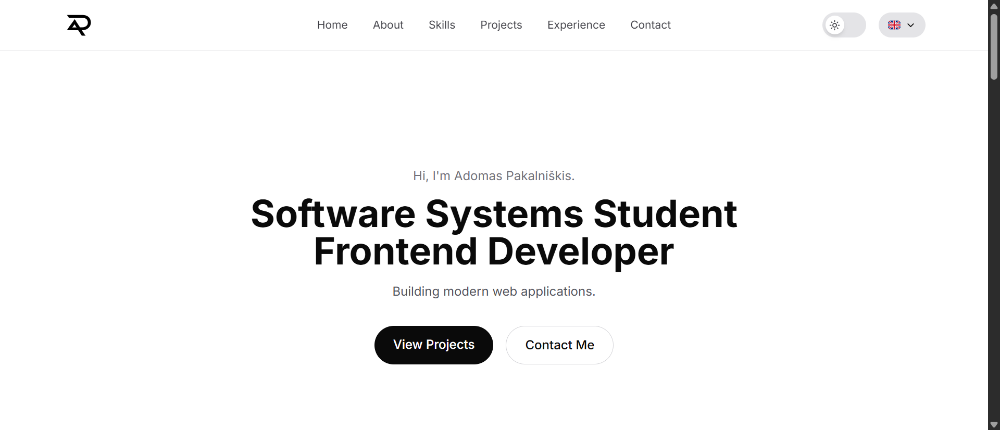
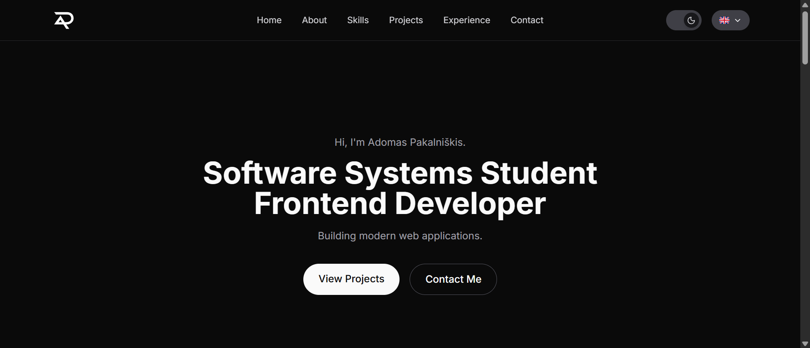
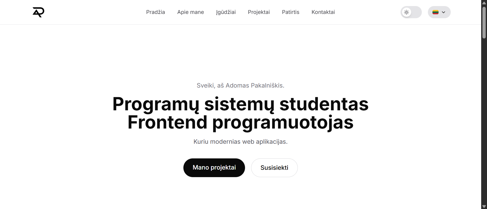
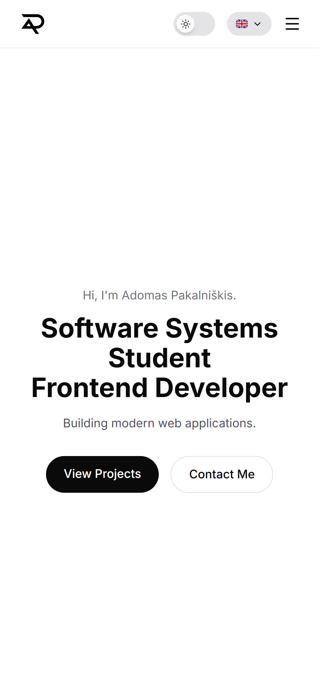

# Personal Portfolio

A single-page developer portfolio built with React, TypeScript, and Vite. Serves as a professional landing page for recruiters, answering who I am, what I know, what I've built, and how to reach me.

**Live:** [adomaspak.com](https://adomaspak.com)



## Features

- **Fully responsive design** — desktop, tablet, and mobile layouts, with a hamburger mobile menu
- **Dark mode** — toggle with `localStorage` persistence and OS preference fallback
- **EN/LT language switcher** — full site translation, persisted in `localStorage`
- **Smooth-scroll navigation** — single-page layout with anchor-based section links
- **Projects section** — self-directed portfolio projects with live demo and GitHub links
- **Copy-to-clipboard email button** — with visual confirmation on copy
- **SEO basics** — meta tags, Open Graph tags, favicon, `robots.txt`
- **Subtle animations** — Hero fade-in on load, card and button hover states
- **Accessible by default** — `aria-label`s on icon-only buttons, semantic landmarks, keyboard-friendly interactive elements

## Screenshots

| Light mode                                            | Dark mode                                           |
| ----------------------------------------------------- | --------------------------------------------------- |
|  |  |

| Lithuanian                                         | Mobile view                                      |
| -------------------------------------------------- | ------------------------------------------------ |
|  |  |

## Tech stack

- **React 19** + **TypeScript** + **Vite**
- **Tailwind CSS v4** — utility-first styling with a custom monochrome theme, configured via `@theme` and `@custom-variant`
- **lucide-react** — icons
- **Inter** (via `@fontsource/inter`) — self-hosted typography, no external font CDN

No backend, no CMS, no state management library — content lives in local data/translation files, and theme/language preferences sync to `localStorage`.

These constraints were intentional: the goal of this project was to build strong visual/UX design skills and get first hands-on experience with Tailwind, without introducing unrelated complexity.

## Getting started

```bash
git clone https://github.com/AD0MAS/personal-portfolio.git
cd personal-portfolio
npm install
npm run dev
```

The app will be available at `http://localhost:5173`.

## Project structure

```
src/
├── components/     # Reusable UI components (one per file)
├── context/        # LanguageContext + provider
├── data/           # Static content and translations
├── hooks/          # Custom hooks (useTheme, useLanguage)
├── types/          # Shared TypeScript types
├── App.tsx         # Root component: composes all sections
└── main.tsx        # Entry point
```

## Notable implementation details

- **Single translation dictionary** — all UI text and content (including project and experience entries) lives in one `data/translations.ts` file, keyed by language, so every string has exactly one source of truth per locale.
- **Theme and language as React Context** — `useTheme` and `useLanguage` custom hooks expose the active theme/language and a setter to any component, with state persisted to `localStorage` and re-synced on load.
- **Type-safe translations** — the `Translations` interface guarantees both `en` and `lt` dictionaries implement the exact same shape, so a missing translation key is caught at compile time, not discovered in the browser.
- **CSS-variable-driven theming** — light/dark colors are defined once as CSS custom properties and swapped via a `.dark` class on `<html>`, so components read semantic tokens (`bg-background`, `text-foreground`) rather than hardcoded colors.

## Deployment

Deployed on [Vercel](https://vercel.com), with automatic redeploys on every push to `main`.

## License

This project is open source and available under the [MIT License](LICENSE).
